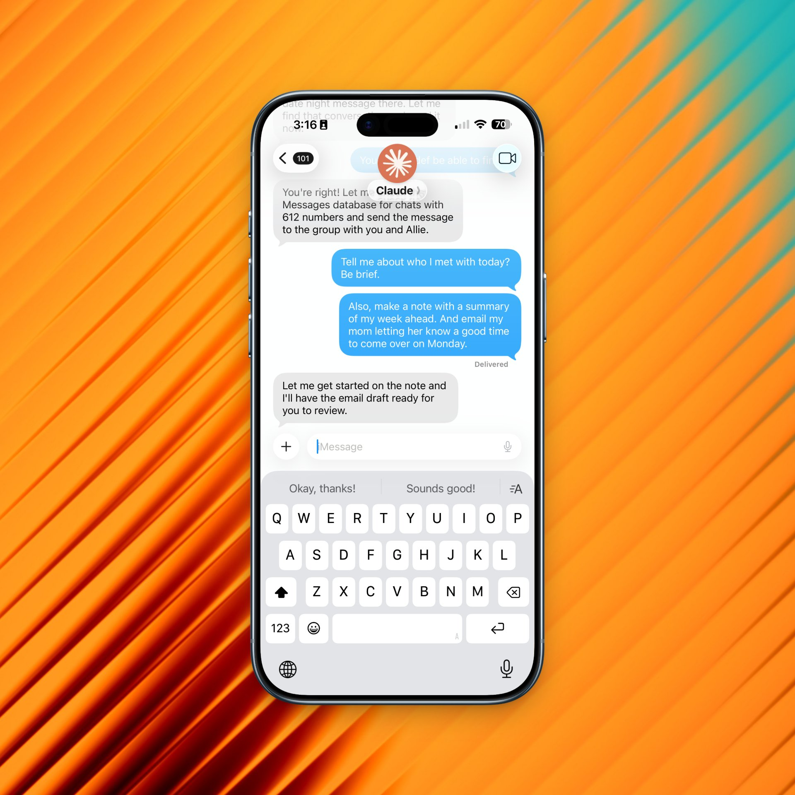

> ⚠️ **Use this plugin at your own risk.** This is created for personal use, and running Claude Code with permissions off as a bot on a Mac connected to iMessage and the Internet exposes your computer to considerable security risks. The author is not responsible for your use of this, and you are assuming all liability by using it.

---

# Claude Code iMessage Assistant

An iMessage assistant that monitors for messages and responds using the full power of Claude Code.



## What is this?

This plugin adds iMessage capabilities to Claude Code, allowing you to:

1. **Read and send iMessages** via command-line tools
2. **Run a daemon** that monitors incoming messages from a specific contact
3. **Trigger autonomous agent sessions** where Claude can work on tasks, check for follow-up messages, and send multiple replies
4. **Use the full Claude Code ecosystem** - the agent has access to all your skills, tools, and resources

The daemon creates a continuous conversation thread with Claude Code over iMessage, making it accessible from iPhone, iPad, Mac, or Apple Watch.

## Installation & Setup

### Prerequisites

- macOS with Messages app signed in to iMessage
- Claude Code installed ([get Claude Code](https://code.claude.com))
- Full Disk Access permission for Terminal (System Preferences > Security & Privacy > Privacy > Full Disk Access)

### 1. Install the Plugin

```bash
# In any Claude Code session
/plugin marketplace add dvdsgl/claude-imessage
/plugin install imessage@dvdsgl
```

### 2. Configure the Daemon

Create a configuration file with the contact details of the person who will message the agent (the agent will respond to messages from this contact):

```bash
# Create config file
cat > ~/.claude-imessage.env << 'EOF'
export IMESSAGE_CONTACT_PHONE="4155551234"      # Their phone number (digits only)
export IMESSAGE_CONTACT_NAME="John Doe"         # Their name
export IMESSAGE_CONTACT_EMAIL="john@example.com"  # Optional: their iMessage email
EOF

# Load the configuration
source ~/.claude-imessage.env
```

### 3. Start the Daemon

In any Claude Code session:

```bash
/imessage-daemon start
```

The daemon is now running and monitoring for messages from your configured contact!

### 4. Send a Message

Send an iMessage from your configured contact's phone, and watch Claude respond autonomously.

### 5. Manage the Daemon

```bash
/imessage-daemon status  # Check if running and view logs
/imessage-daemon stop    # Stop the daemon
/imessage-daemon start   # Start the daemon
```

## Features

### iMessage Skill

The plugin includes a comprehensive iMessage skill with tools for:

- **Reading messages**: Access message history and conversation context via SQLite database
- **Sending messages**: Send to contacts, phone numbers, or group chats
- **Checking new messages**: Monitor for incoming messages
- **File attachments**: Send and receive files, images, documents
- **Conversation management**: List conversations, get chat identifiers

See [`skills/imessage/SKILL.md`](skills/imessage/SKILL.md) for complete documentation.

### Auto-Reply Daemon

The daemon monitors iMessages and automatically:

1. Detects new messages from a configured contact
2. Starts an autonomous Claude Code agent session
3. Sends multiple messages as it works on tasks
4. Checks for new messages every 30-60 seconds
5. Maintains conversation continuity across sessions

The agent has access to all Claude Code capabilities including other skills, tools, and can perform complex multi-step tasks autonomously.

## Using the iMessage Skill

Once installed, you can use iMessage tools in any Claude Code conversation:

```bash
# Read recent messages from a contact
claude -p "Use the imessage skill to read my recent messages from 4155551234"

# Send a message
claude -p "Use the imessage skill to send a message to 4155551234 saying 'Hello!'"

# Check for new messages
claude -p "Use the imessage skill to check if I have any new messages"
```

## How It Works

### Agent Workflow

When the daemon receives a message, it:

1. **Starts a Claude Code agent** with your message as the prompt
2. **Provides full context**: Recent conversation history, available skills/tools
3. **Runs autonomously**: The agent can:
   - Send multiple messages as it works
   - Check for new messages from you
   - Use any Claude Code skills (calendar, files, APIs, etc.)
   - Break down complex tasks into steps
   - Ask for clarification when needed
4. **Maintains continuity**: Uses conversation resume to maintain context across sessions

### Conversation Continuity

The daemon uses Claude Code's conversation resume feature:

- First message starts a new conversation
- Subsequent messages resume the same conversation ID
- Full history is available across all agent sessions
- Conversation ID saved in `~/tmp/imessage/imessage_claude_conversation_id.txt`

### Example Interaction

```
You: "What's on my calendar today?"
Claude: "Let me check your calendar..."
Claude: "You have 3 events today:
        - 9am: Team standup
        - 2pm: Product review
        - 4pm: 1:1 with Sarah"

You: "Remind me to prepare slides before the product review"
Claude: "I'll create a reminder..."
Claude: "Done! Added a reminder for 1:30pm to prepare slides."
```

## Configuration

### Environment Variables

Configure the daemon via environment variables in `~/.claude-imessage.env`:

| Variable | Required | Description |
|----------|----------|-------------|
| `IMESSAGE_CONTACT_PHONE` | Yes | Phone number of the person who will message the agent (digits only) |
| `IMESSAGE_CONTACT_NAME` | Yes | Name of the person who will message the agent |
| `IMESSAGE_CONTACT_EMAIL` | No | iMessage email of the person (if they use email for iMessage) |
| `IMESSAGE_CHECK_INTERVAL` | No | Check interval in seconds (default: 1) |
| `IMESSAGE_TMP_DIR` | No | Directory for logs (default: ~/tmp/imessage) |

### Example Configuration

```bash
# ~/.claude-imessage.env
export IMESSAGE_CONTACT_PHONE="4155551234"
export IMESSAGE_CONTACT_NAME="Alice Smith"
export IMESSAGE_CHECK_INTERVAL="1"
export IMESSAGE_TMP_DIR="$HOME/tmp/imessage"
```

Load before starting the daemon:

```bash
source ~/.claude-imessage.env
/imessage-daemon start
```

## Security Considerations

- The daemon has full access to your iMessage database
- Claude Code can send messages on your behalf
- Environment variables may contain sensitive phone numbers
- Logs may contain message content
- Only run the daemon in trusted environments
- Be mindful of which contact you monitor
